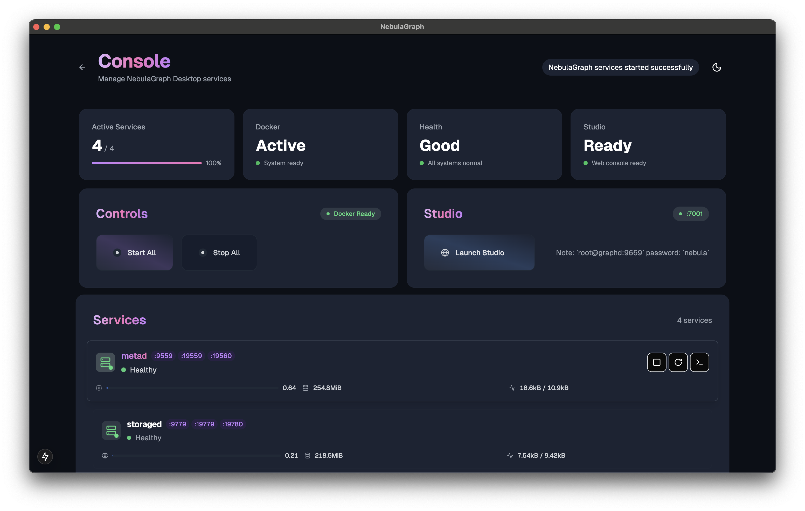

# NebulaGraph Desktop

<!-- Project Status -->
[](https://github.com/wey-gu/nebulagraph-desktop/releases) [](https://github.com/wey-gu/NebulaGraph-Desktop/actions/workflows/build.yml) [](https://github.com/wey-gu/NebulaGraph-Desktop/blob/main/LICENSE)

<!-- Download Options -->
[](https://github.com/wey-gu/nebulagraph-desktop/releases) [](https://github.com/wey-gu/nebulagraph-desktop/releases)

<!-- Built With -->
[](https://github.com/vesoft-inc/nebula) [](https://www.electronjs.org/) [](https://www.typescriptlang.org/) [](https://www.docker.com/get-started)

A modern, cross-platform desktop version of NebulaGraph.



## Features

- 🚀 Modern, intuitive interface for managing NebulaGraph services
- 🔄 Real-time service monitoring and health checks
- 📊 Resource usage metrics (CPU, Memory, Network)
- 🔧 Individual service controls
- 📝 Service logs viewer
- 🎨 Beautiful, responsive UI
- 🌐 Offline mode support (no Docker Hub image pull needed)

## Quick Start

1. Install [Docker](https://www.docker.com/get-started) on your system

2. Download NebulaGraph Desktop from the [releases page](https://github.com/wey-gu/nebulagraph-desktop/releases)

   - for macOS, you need to install the `dmg` file, and do one extra step as below.
   - for Windows, you need to install the `exe` file

3. Install and launch the application

4. Click "Start All" to launch NebulaGraph services

5. Open Studio in your browser to start working with NebulaGraph

Note: fill in `graphd` as "IP Address" and `9669` as "Port", user and password: `root`/`nebula`

### macOS extra step

> copied from [OpenAI Translator](https://github.com/openai-translator/openai-translator/)

This step is to fix the error: "NebulaGraph Desktop can't be opened because the developer cannot be verified." or "This app is damaged and suggested to be moved to Trash."

<p align="center">
    
</p>

- Click the `Cancel` button, then go to the `Settings` -> `Privacy and Security` page, click the `Still Open` button, and then click the `Open` button in the pop-up window. After that, there will be no more pop-up warnings when opening `NebulaGraph Desktop`. 🎉
    <p align="center">
         
    </p>

- If you cannot find the above options in `Privacy & Security`, or get error prompts such as broken files with Apple Silicon machines. Open `Terminal.app` and enter the following command (you may need to enter a password halfway through), then restart `NebulaGraph Desktop`:

  ```sh
  sudo xattr -d com.apple.quarantine /Applications/NebulaGraph\ Desktop.app
  ```

## System Requirements

- Windows 10/11, macOS 10.15+
- Docker Desktop installed and running
- 8GB RAM minimum (16GB recommended)
- 10GB free disk space

## Development

See [DEVELOPMENT.md](./DEVELOPMENT.md) for detailed dev instructions and progress.

## License

Apache License 2.0
